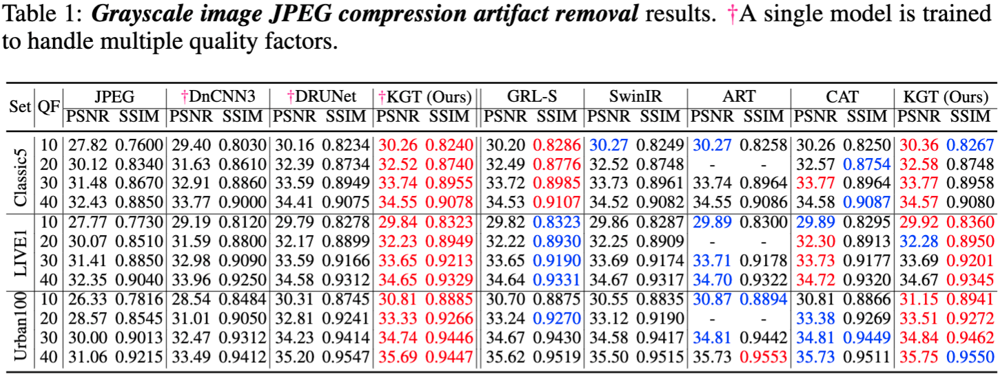
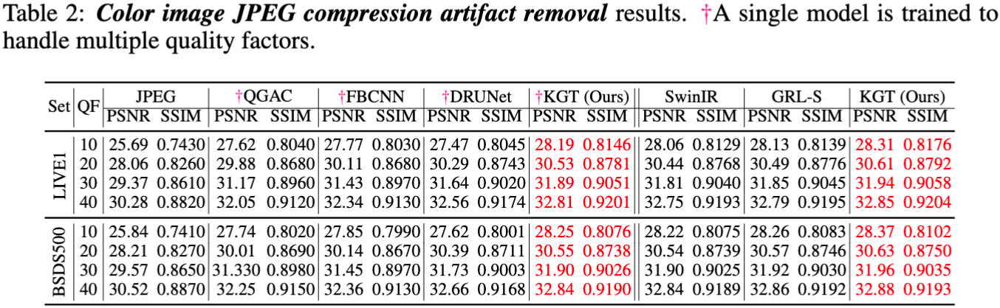
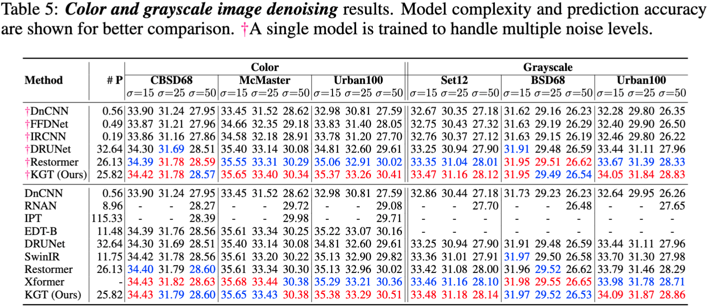
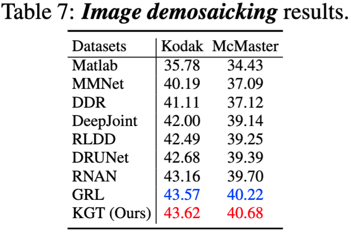
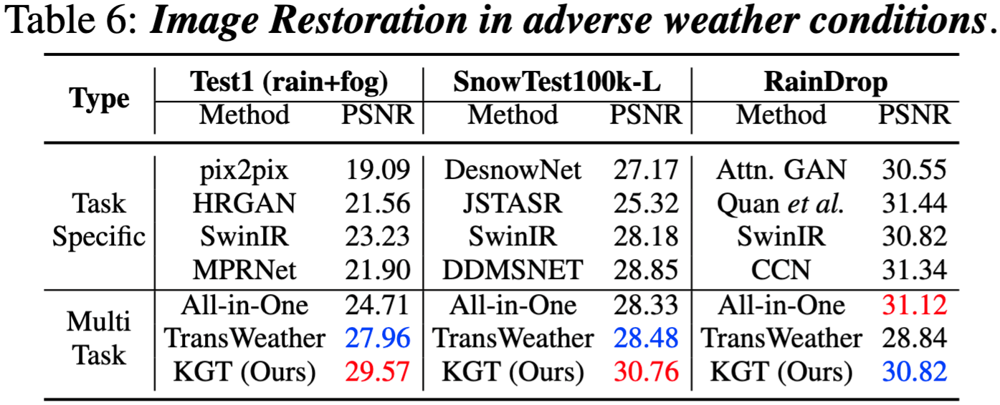
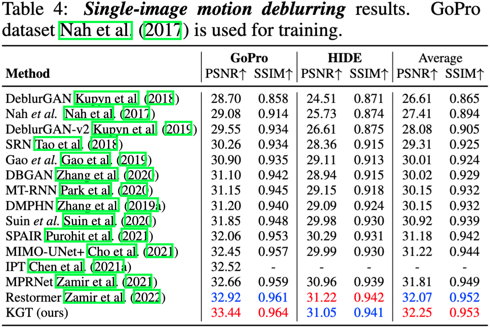

# Key-Graph Transformer for Image Restoration
This repository is an official implementation of the paper Key-Graph Transformer (KGT) for Image Restoration.

[Bin Ren](https://scholar.google.com/citations?hl=en&user=Md9maLYAAAAJ)<sup>1,2,3</sup>$^\star$, [Yawei Li](https://scholar.google.com/citations?user=IFLsTGsAAAAJ&hl=en)<sup>4</sup>$^\dagger$, [Jingyun Liang](https://scholar.google.com/citations?user=3-Hz9BgAAAAJ&hl=en)<sup>4</sup>, Rakesh Ranjan<sup>5</sup>, [Mengyuan Liu](https://scholar.google.com/citations?hl=en&user=woX_4AcAAAAJ)<sup>6</sup>, [Rita Cucchiara](https://scholar.google.com/citations?user=OM3sZEoAAAAJ&hl=en)<sup>7</sup>, [Luc Van Gool](https://scholar.google.com/citations?user=TwMib_QAAAAJ&hl=en)<sup>3</sup>, [Ming-Hsuan Yang](https://scholar.google.com/citations?user=p9-ohHsAAAAJ&hl=en)<sup>8</sup>, and
 [Nicu Sebe](https://scholar.google.com/citations?user=stFCYOAAAAAJ&hl=en)<sup>2</sup> <br>
$\star$: Work done during visiting at ETH Zurich and INSAIT Sofia University. <br>
$\dagger$: Project Leader \& Corresponding Author. Email: li.yawei.ai@gmail.com <br>
<sup>1</sup>University of Pisa, Italy <br>
<sup>2</sup>University of Trento, Italy <br> 
<sup>3</sup>UINSAIT, Sofia University, BG <br> 
<sup>4</sup>ETH Zürich, Switzerland <br>
<sup>5</sup>Meta Reality Labs <br>
<sup>6</sup>Peking University, China <br>
<sup>7</sup>University of Modena and Reggio Emilia, Italy <br>
<sup>8</sup>University of California, Merced <br>


## News :fire:
- [ ] The ...

## Coming Soon :t-rex:
- [ ] The ...

## Introduction
Image Restoration (IR), a classic low-level vision task, has witnessed significant advancements through deep models that effectively model global information. Notably, the emergence of Vision Transformers (ViTs) has further propelled these advancements. When computing, the self-attention mechanism, a cornerstone of ViTs, tends to encompass all global cues, even those from semantically unrelated objects or regions. This inclusivity introduces computational inefficiencies, particularly noticeable with high input resolution, as it requires processing irrelevant information, thereby impeding efficiency. Additionally, for IR, it is commonly noted that small segments of a degraded image, particularly those closely aligned semantically, provide particularly relevant information to aid in the restoration process, as they contribute essential contextual cues crucial for accurate reconstruction. 
To address these challenges, we propose boosting IR's performance by sharing the key semantics via Transformer for IR (\ie, SemanIR) in this paper. Specifically, SemanIR initially constructs a sparse yet comprehensive key-semantic dictionary within each transformer stage by establishing essential semantic connections for every degraded patch. Subsequently, this dictionary is shared across all subsequent transformer blocks within the same stage. This strategy optimizes attention calculation within each block by focusing exclusively on semantically related components stored in the key-semantic dictionary. As a result, attention calculation achieves linear computational complexity within each window. Extensive experiments across 6 IR tasks confirm the proposed SemanIR's state-of-the-art performance, quantitatively and qualitatively showcasing advancements.

## How to Use the Code?
- Environments Preparation:
  1. `conda create -n LightningIR python=3.8`
  2. `conda activate LightningIR`
  3. `pip install -r requirements.txt`
- Dataset Preparation:
- Pretrained Models Preparation:

- Training: 
  ```bash
    torchx run -- -j 1x2 -- \
        -m training=False gpus=2 experiment=dm/grl model=grl/grl_small \
        load_state_dict=True pretrained_checkpoint="${MODEL_ZOO}/GRL/dm_grl_small.ckpt"
  ```

## Main Results


## Results
<details>
<summary><strong>JPEG Compression Artifact Removal</strong> (click to expand) </summary>

 
</details>


<details>
<summary><strong>Image denoising</strong> (click to expand) </summary>

 
</details>


<details>
<summary><strong>Image Demosaicking</strong> (click to expand) </summary>

 
</details>


<details>
<summary><strong>Adverse Weather Conditions Restoration</strong> (click to expand) </summary>

 
</details>


<details>
<summary><strong>Image SR</strong> (click to expand) </summary>

 
</details>

<details>
<summary><strong>Single-Image Motion Deblurring</strong> (click to expand) </summary>

 
</details>

## Temperal Documents
- Results: https://docs.google.com/spreadsheets/d/1CNYEl93Tt1l70QC1WmFbgHzCBPtxCOHR7Me6bnGW3M8/edit?usp=sharing
- Slides: https://docs.google.com/presentation/d/1re1ig1lB24shemfcUK5F1buk66zS01xlUms1rrLviNc/edit#slide=id.p 

## Citation

If this work is helpful for your research, please consider citing the following BibTeX entry.

```
@inproceedings{li2023grl,
  title={Key-Graph Transformer for Image Restoration},
  author={Bin Ren, Yawei Li, Jingyun Liang, Rakesh Ranjan, Mengyuan Liu, Rita Cucchiara, Luc Van Gool, and Nice Sebe},
  booktitle={xxx},
  year={2023}
}
```
