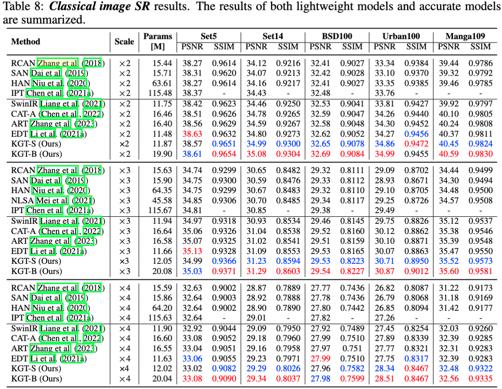

# KGT for Image Restoration
This repository is an official implementation of the paper Key-Graph Transformer for Image Restoration.

By Bin Ren*, Yawei Li*, Jingyun Liang, Rakesh Ranjan, Mengyuan Liu, Rita Cucchiara, Luc Van Gool, Nice Sebe.

## News :fire:
- [ ] The ...

## Coming Soon :t-rex:
- [ ] The ...

## Introduction
It is widely acknowledged that capturing non-local information among input images is crucial for effective image restoration (IR). 
However, fully incorporating such global cues into transformer-based methods can be computationally expensive, particularly when dealing with large input images or patches. 
Furthermore, it is assumed that the attention mechanism within the transformer considers numerous unnecessary cues from unrelated objects or regions. In response to these challenges, we introduce the K-Graph Transformer (KGT) for IR in this paper. Specifically, KGT treats image features within a given window as the nodes of a graph. 
Instead of establishing connections among all the nodes, the proposed K-Graph Constructor creates a sparse yet representative K-Graph that connects only the essential nodes flexibly. 
Then the K-Graph Attention Block is proposed within each KGT layer to conduct the self-attention operation only among these selected nodes with linear computational complexity.
Extensive experimental results validate that the proposed KGT outperforms state-of-the-art methods on various benchmark datasets both quantitatively and qualitatively.

## How to Use the Code?
- Environments Preparation:
  1. `conda create -n LightningIR python=3.8`
  2. `conda activate LightningIR`
  3. `pip install -r requirements.txt`
- Dataset Preparation:
- Pretrained Models Preparation:

- Training: 
  ```bash
    torchx run -- -j 1x2 -- \
        -m training=False gpus=2 experiment=dm/grl model=grl/grl_small \
        load_state_dict=True pretrained_checkpoint="${MODEL_ZOO}/GRL/dm_grl_small.ckpt"
  ```

## Main Results


## Results
<details>
<summary><strong>JPEG Compression Artifact Removal</strong> (click to expand) </summary>

 
</details>


<details>
<summary><strong>Image denoising</strong> (click to expand) </summary>

 
</details>


<details>
<summary><strong>Image Demosaicking</strong> (click to expand) </summary>

 
</details>


<details>
<summary><strong>Adverse Weather Conditions Restoration</strong> (click to expand) </summary>

 
</details>


<details>
<summary><strong>Image SR</strong> (click to expand) </summary>

 
</details>


<details>
<summary><strong>Single-Image Motion Deblurring</strong> (click to expand) </summary>

 
</details>


## Temperal Documents


## Citation

If this work is helpful for your research, please consider citing the following BibTeX entry.

```
@inproceedings{li2023grl,
  title={Key-Graph Transformer for Image Restoration},
  author={Bin Ren*, Yawei Li*, Jingyun Liang, Rakesh Ranjan, Mengyuan Liu, Rita Cucchiara, Luc Van Gool, and Nice Sebe},
  booktitle={xxx},
  year={2023}
}
```

*: Co-first Authors
